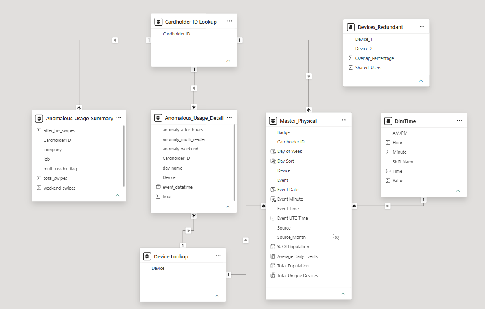
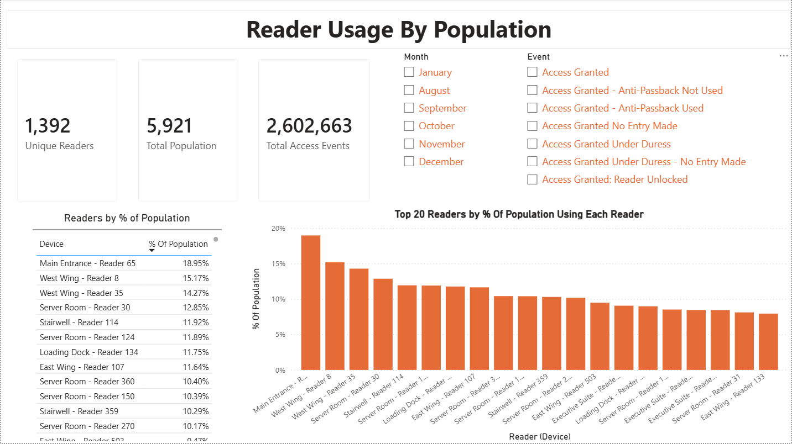
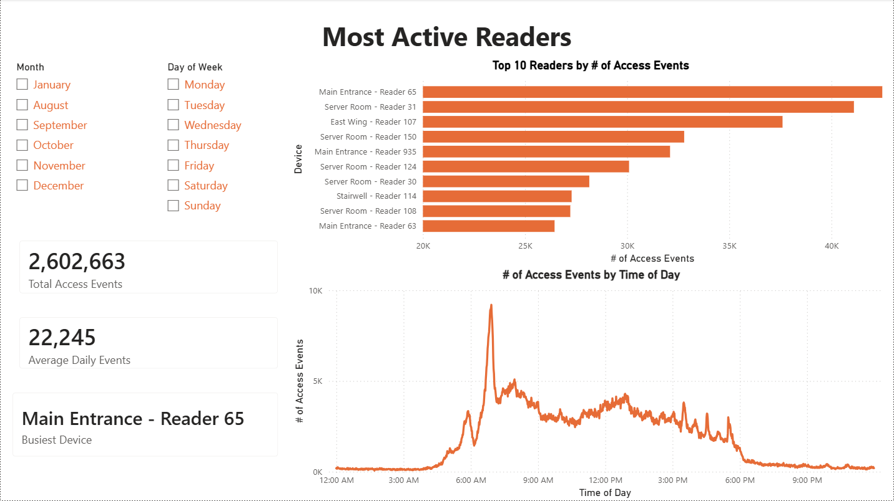
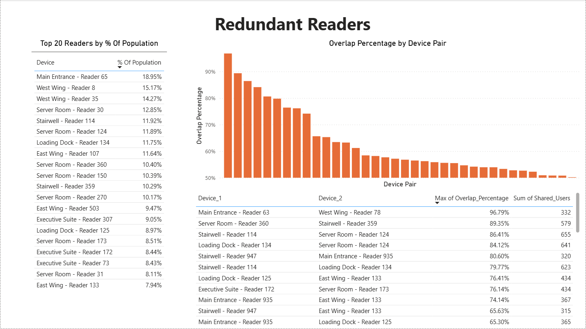
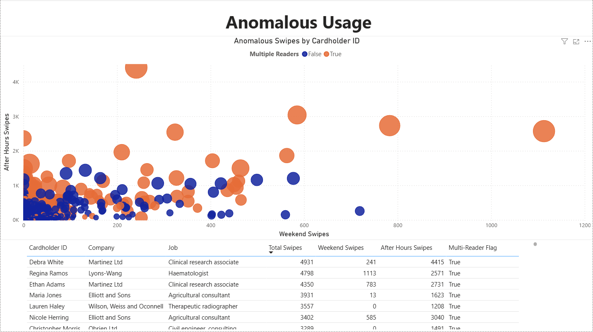

# Identity & Access Governance Analytics

> **End-to-end access governance and threat-detection project** utilizing Python for ETL and Power BI for role-based access modeling (RBAC), privilege-creep remediation, and maintenance prioritization.

*A semester-long data analytics project analyzing physical and logical access datasets provided by OG&E to the University of Oklahoma.*

---

## Executive Summary & Problem Context

* **The Challenge:** Enterprise infrastructure systems often struggle with fragmented physical security logs and sprawling logical access rights. Over time, role changes and lack of centralized auditing lead to security vulnerabilities, operational inefficiencies, and significant privilege creep.
* **The Solution & Key Outcomes:**
  * **Unified Access Model:** Architected a standardized Role-Based Access Control (RBAC) model covering **80% of the employee population** under least-privilege profiles.
  * **Privilege Creep Mitigation:** Flagged anomalous accounts, lingering elevated privileges, and disconnected user-role assignments for immediate auditing.
  * **Physical Security & Maintenance:** Pinpointed high-traffic physical access points requiring prioritized preventive maintenance and identified redundant card-swipe points for decommissioning.
  * **Anomaly Detection:** Isolated unusual access attempts, after-hours physical entries, and logical permission outliers using statistical flags.

---

## Architecture & Workflow

### 1. Extraction & Preparation (Python / Pandas)
* Cleaned, formatted, and reconciled multi-source physical badge swipe logs and Active Directory/HR records using **Python (pandas)** in Google Colab.
* Handled missing timestamps, deduplicated access records, and standardized role/department nomenclature.

### 2. Semantic Modeling (Power BI)
* Ingested processed datasets into **Power BI** to construct an optimized **Star Schema**.
* Established 1-to-many (`1:*`) unidirectional relationships bridging fact access logs with custom dimension tables (`DimTime`, `Cardholder ID Lookup`, and `Device Lookup`)



### 3. Analysis & Metrics (DAX)
* Engineered custom **DAX measures** to quantify profile overlap, flag inactive high-privilege credentials, and calculate least-privilege coverage percentages.
* Built threshold alerts to dynamically classify accounts into tiered risk profiles.

### 4. Executive Delivery & Stakeholder Presentation
* Built an interactive, role-based dashboard suite delivering targeted, drill-through insights for security administrators and infrastructure executives.
* Formally presented analytical findings and strategic policy recommendations to an audience of over **50 OG&E analysts, executives, and University of Oklahoma faculty**.

---

## Visual Portfolio: Physical Infrastructure & Reader Analytics

The dashboard suite was built around modular, recommendation-driven report pages designed to give stakeholders immediate, actionable insights on specific recommendations.

While the overall team deliverable encompassed both physical and logical access layers, the dashboards below highlight my direct analytical deliverables. Throughout the project, I focused on physical security, foot-traffic distribution, and hardware maintenance prioritization.

### 1. Badge Reader Usage By Population & Density

* **Business Objective:** Identify badge readers accessed by a disproportionate share of the employee base to evaluate operational redundancy, recommend preventative maintenance or targeted security improvements, and pinpoint physical security choke points.
* **Key Analytical Insight:** Isolated the top 20 most commonly utilized access points across the enterprise footprint, discovering that the single highest-traffic reader processed badge events for over 16% of the entire employee base. These 20 readers represent prime single-point-of-failure risks, primary targets for physical tailgating/camouflage vulnerabilities, and candidates for throughput optimization.
* **Technical Implementation & Core Metrics:** Engineered DAX measures calculating distinct employee counts per physical reader `DISTINCTCOUNT` divided by the total active population to calculate the usage rate of each badge reader, displaying reader traffic via `Top-N` visual filters in Power BI.

### 2. Most Active Badge Readers

* **Business Objective:** Analyze physical access event volumes across devices and operating hours to identify readers subject to high levels of wear-and-tear, detect potential volume-based security attacks (such as brute-force entry attempts, credential flooding, or denial-of-service disruptions), and strip away anomaly camouflage.
* **Key Analytical Insight:** Isolated the top 10 badge readers by sheer volume of access events as potential targets for maintenance and security reinforcements. Additionally, analyzed aggregate access events by time of day to uncover a baseline for standard business hours.
* **Technical Implementation & Core Metrics:** Aggregated raw access event logs using `COUNTROWS` to rank hardware utilization across a Top-10 bar chart, paired with a temporal line chart binning event timestamps by time of day (hh:mm). Configured dynamic KPI cards to display aggregate event volume and isolate the highest-throughput reader.

### 3. Redundant Badge Readers

* **Business Objective:** Analyze the sets of users accessing each badge reader to identify pairs of readers that are redundant or serve the same purpose, potentially using up resources that could be allocated elsewhere.
* **Key Analytical Insight:** Identified pairs of badge readers that share a large portion of unique users as devices that could be redundant or unnecessary. Redundant readers present opportunities for the reallocation of resources, security monitoring, and reducing potential targets for attacks or threats.
* **Technical Implementation & Core Metrics:** Calculated the Jaccard Similarity score (`overlap_percentage = shared_users / total_unique_users`) of the sets of unique users for every possible pairing of the top 5% of badge readers by total unique users (`total_unique_users = master_df['Cardholder ID'].nunique()`). Presented the most redundant pairs of badge readers in a column chart, sorted by overall overlap percentage and including all badge readers in the top 5% by total unique user count.

### 4. Anomalous Usage/Threat Identification

* **Business Objective:** Analyze physical access data to identify and prevent anomalous usage such as unauthorized or unmonitored access, reconnaissance/scouting by dangerous individuals, or isolate attacks at times when the company's presence and security are less prevalent. 
* **Key Analytical Insight:** Uncovered outlying badge events occurring outside standard business hours and identified suspicious multi-reader access sequences occurring across disparate locations within unusually narrow timeframes. Isolating these behaviors provides security teams with an actionable triage queue of high-risk physical access attempts and compromised or at-risk cardholders.
* **Technical Implementation & Core Metrics:** Queried and filtered the physical access dataset to isolate anomalous access events (weekend and after-hours events) and flag rapid multi-reader swipe instances. Compiled findings into an interactive bubble chart mapping individual cardholders by weekend events (X-axis) and after-hours events (Y-axis), with bubble sizing representing total volume and color-coding highlighting multi-reader or single-reader activity.

---

## Code Highlights & Analytical Logic

This section highlights core data transformations and mathematical models developed in Python and DAX to process physical access logs and quantify security risks.

### 1. Cleaning and Wrangling the Physical Access Data (Python / Pandas)

Importing, cleaning, and wrangling the physical access data provided by OG+E. This included importing and concatenating split datasets into a master dataset, standardizing and updating data types, removing blank or unusable items/rows, and lastly exporting the cleaned data for use in Power BI.

#### *Importing and Concatenating Datasets*

Google Colab, and by extension Google Drive, was used to collaborate with team members and store files.

```python
import glob
import os
import pandas as pd

# Importing all datasets using glob
folder_path = 'data/raw/physical_access'
physical_files = glob.glob(os.path.join(folder_path, "*.csv"))

# List to hold the dataframes
df_list = []

for file in physical_files:
  # Read the current file
  temp_df = pd.read_csv(file)

  # Store the name of the original file
  temp_df['Source_Month'] = os.path.basename(file)

  # Append to the list
  df_list.append(temp_df)

# Assemble the datasets stacked on top of each other, rather than merged
master_df = pd.concat(df_list, ignore_index=True)
```
* **Core Logic/Functionality:** Leveraged `glob` and `os.path` to build an automated, path-agnostic batch ingestion loop, tracking source filenames to maintain data lineage across partitions.
* **Analytical Impact:** Replaced manual multi-file merging with a scalable pipeline, consolidating fragmented enterprise logs into a unified dataset for comprehensive analysis.

#### *Standardizing and Updating Data Types*

```python
# Removing blank/useless first-rows
# If an event has no Cardholder ID or Device, it is not useful to us
master_df = master_df.dropna(subset=['Cardholder ID', 'Device'])

# Converting Event Time and Event UTC Time to DateTime format
# Event Time formatted as string HH:MM:SS for time binning in Power BI
master_df['Event Time'] = pd.to_datetime(master_df['Event Time'], format='%H:%M:%S', errors='coerce').dt.strftime('%H:%M:%S')
master_df['Event UTC Time'] = pd.to_datetime(master_df['Event UTC Time'], format='%Y-%m-%d %H:%M:%S', errors='coerce')

# Drop rows that failed DateTime/string conversion
master_df = master_df.dropna(subset=['Event Time', 'Event UTC Time'])

# Standardizing Cardholder ID and Badge to String format
master_df['Badge'] = master_df['Badge'].astype(str).str.strip()
master_df['Cardholder ID'] = master_df['Cardholder ID'].astype(str).str.strip()
```

* **Core Logic:** Implemented defensive parsing with `errors='coerce'` to handle malformed timestamp anomalies and stripped whitespace across composite entity keys (Badge, Cardholder ID).
* **Analytical Impact:** Ensured data integrity and consistency prior to relational modeling in Power BI, preventing bugs, errors, and join failures in later analysis.

> **NOTE: Exporting for Use in Power BI**
>
> Data was exported as a `.parquet` file instead of a `.csv` due to the volume of the dataset. The human-readable aspect of `.csv` files was traded for the vastly reduced storage footprints, preserved schema data types, and optimized query/query load speeds of `.parquet` files.

---

### 2. Python Analysis (Jaccard Similarity Score & Anomalous Usage)

While most analysis was done in Power BI, Python was used to detect redundant readers using the Jaccard Similarity Score and to detect anomalous usage.

#### *Redundant Readers/Jaccard Similarity Score*

```python
import itertools

# Set a cutoff threshold of 5% to focus on high-impact devices
total_users = master_df['Cardholder ID'].nunique()
threshold = total_users * 0.05

# Count the unique users for each device and filter by the threshold cutoff
device_user_counts = master_df.groupby('Device')['Cardholder ID'].nunique()
top_devices = device_user_counts[device_user_counts >= threshold].index.tolist()

# Create a dictionary mapping each device to a set of its unique users
device_user_sets = {}
for device in top_devices:
  # Extract the unique Cardholder IDs for this device
  users = set(master_df[master_df['Device'] == device]['Cardholder ID'].unique())
  device_user_sets[device] = users

redundant_devices = []

# Using itertools library, pair each device with every other device exactly once
for device_A, device_B in itertools.combinations(top_devices, 2):
  set_A = device_user_sets[device_A]
  set_B = device_user_sets[device_B]

  # Calculate the overlap (intersection)
  shared_users = len(set_A.intersection(set_B))

  # Calculate the total unique pool (union)
  total_unique_users = len(set_A.union(set_B))

  # Calculating the Jaccard Similarity score (0.0 to 1.0)
  if total_unique_users > 0: # Prevent division by zero
    overlap_percentage = shared_users / total_unique_users
  else:
    overlap_percentage = 0

  # Add high overlap_percentage devices to our set of redundant_devices
  redundant_devices.append({
      'Device_1': device_A,
      'Device_2': device_B,
      'Shared_Users': shared_users,
      'Overlap_Percentage': overlap_percentage
  })

# Creating a Redundancy Data Frame
redundancy_df = pd.DataFrame(redundant_devices)
redundancy_df = redundancy_df.sort_values(by='Overlap_Percentage', ascending=False)
```
* **Core Logic/Functionality:** Implemented `itertools.combinations` to analyze every unique pair of devices within the threshold for evaluation, employing set operations (`intersection` and `union`) across high-volume devices' cardholder sets to calculate the Jaccard Similarity score of each pair.
* **Analytical Impact:** Provided a metric-driven basis for identifying potentially redundant access points/readers that may be targets for resource reallocation or removal entirely.

#### *Anomalous Usage*

The NumPy library was imported to perform statistical calculations, such as Z-score, 95th percentile, and standard deviation.

``` python
import numpy as np

# Identify off-hours and weekend access
master_df['hour'] = master_df['event_datetime'].dt.hour
master_df['is_weekend'] = master_df['event_datetime'].dt.dayofweek >= 5
master_df['is_after_hours'] = (master_df['hour'] < 7) | (master_df['hour'] >= 18)

# Count distinct readers per cardholder in a set timeframe
results = []
for cardholder, group in master_df.groupby('Cardholder ID'):
    times = group['event_datetime'].values
    devices = group['Device'].values
    
    for i in range(len(times)):
        # Define the look-back window from the current access event
        window_start = times[i] - np.timedelta64(WINDOW_MINUTES, 'm')
        in_window = (times >= window_start) & (times <= times[i])
        
        # Count unique readers accessed during this specific window
        distinct_readers = len(set(devices[in_window]))
        results.append({
            'Cardholder ID': cardholder, 
            'distinct_readers': distinct_readers
        })

reader_window_df = pd.DataFrame(results)

# Flag top 5% or Z-score > 2 as anomalous
perc95_r = reader_window_df['distinct_readers'].quantile(0.95)
stdev_r = reader_window_df['distinct_readers'].std()
mean_r = reader_window_df['distinct_readers'].mean()

reader_window_df['z_score'] = (reader_window_df['distinct_readers'] - mean_r) / stdev_r
reader_window_df['is_unusual'] = (reader_window_df['z_score'] > 2) | (reader_window_df['distinct_readers'] > perc95_r)
```
* **Core Logic/Functionality:** Extracted the time components of events to group access windows, using a custom rolling-window loop over NumPy datetime arrays to track localized device density per employee.
* **Analytical Impact:** Implemented statistical outlier boundaries (Z-score and 95th percentile), isolating high-frequency physical sweeps and off-hours entry risks into an actionable security review queue.

---

### 3. Data Modeling & DAX Measures for Power BI Analysis

Engineered a star-schema model supported by custom dimension tables and dynamic DAX measures to evaluate operational traffic and infrastructure penetration.

#### *Dynamic Time Dimension & Shift Segmentation (Calculated Table)*
Constructed a granular 1,440-minute temporal dimension table from scratch to map access timestamps against corporate operating shifts without requiring external datetime tables.

```dax
DimTime =
GENERATE(
    GENERATESERIES(0, 23, 1), // Generates Hours 0-23
    VAR CurrentHour = [Value]
    RETURN
    SELECTCOLUMNS(
        GENERATESERIES(0, 59, 1), // Generates Minutes 0-59
        "Minute", [Value],
        "Time", TIME(CurrentHour, [Value], 0),
        "Hour", CurrentHour,
        "AM/PM", FORMAT(TIME(CurrentHour, [Value], 0), "tt"),
        "Shift Name", 
            SWITCH(
                TRUE(),
                CurrentHour >= 22 || CurrentHour < 5, "Graveyard (10PM - 5AM)",
                CurrentHour >= 5 && CurrentHour < 14, "Morning (5AM - 2PM)",
                CurrentHour >= 14 && CurrentHour < 22, "Swing (2PM - 10PM)",
                "Unknown"
            )
    )
)
```
* **Core Logic/Functionality:** Combined nested `GENERATESERIES` within a `GENERATE` cross-join to build a minute-by-minute table, applying `SWITCH(TRUE())` conditional logic to tag events into enterprise work shifts (Morning, Swing, Graveyard).
* **Analytical Impact:** Provided the dimensional baseline for the time-of-day traffic distribution visual (see "Most Active Readers" dashboard), grouping access tracking into actionable business windows.

#### *Population Evaluation (Measures)*
Calculated device-level population usage rates by benchmarking individual reader traffic against total business population.

```dax
Total Population = 
CALCULATE (
    DISTINCTCOUNT('Master_Physical'[Cardholder ID]), 
    ALL('Master_Physical')
)

% Of Population = 
DIVIDE(
    DISTINCTCOUNT(Master_Physical[Cardholder ID]),
    [Total Population],
    0
)
```
* **Core Logic/Functionality:** Utilized `CALCULATE` and `ALL` to establish a baseline of distinct cardholders, followed by safe division via `DIVIDE` to calculate penetration ratios.
* **Analytical Impact:** Powered the "Reader Usage by Population" dashboard, uncovering the overall usage rate of each reader and identifying the single reader that processed access for over 16% of the corporate base, the highest of all readers.

#### *Normalized Daily Throughput (Measure)*
Calculated the average daily throughput of all badge readers, providing a simple, streamlined measure for an important KPI (see "Most Active Readers" dashboard).

```dax
Average Daily Events =
DIVIDE(
    COUNT(Master_Physical[Event]),
    DISTINCTCOUNT(Master_Physical[Event Date]),
    0
)
```
* **Core Logic/Functionality:** Aggregated and averaged total access events across the entire date-range of the dataset to establish a baseline rate of daily reader throughput.
* **Analytical Impact:** Provided hardware teams with reliable average load metrics, preventing skewed maintenance or security targeting caused by single-day and single-reader spikes or other anomalies.
